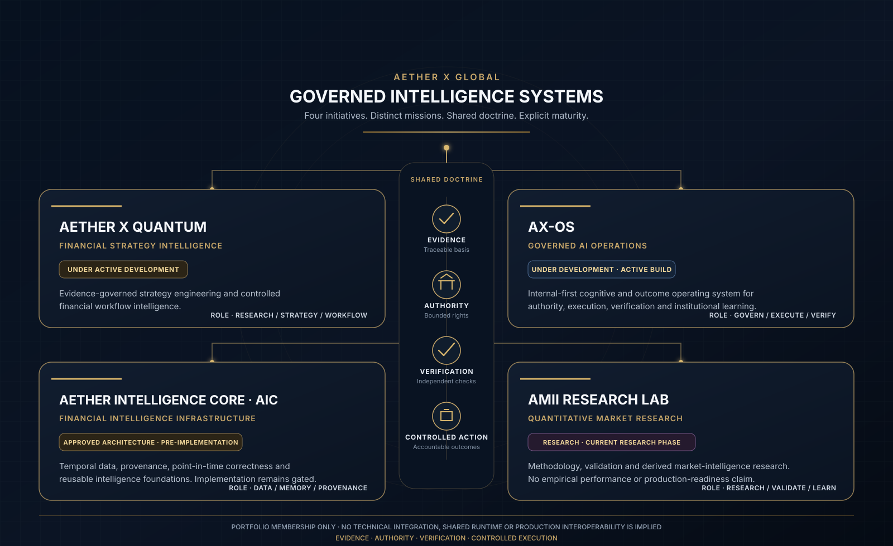

<p align="center">
  
</p>

<h1 align="center">AETHER X GLOBAL</h1>

<p align="center">
  <strong>A Governed Intelligence Systems Company</strong>
</p>

<p align="center">
  <strong>Institutional Intelligence. Governed Autonomy.</strong>
</p>

<p align="center">
  <strong>Build Intelligence That Can Be Trusted to Act.</strong>
</p>

<p align="center">
  We engineer governed intelligence systems for consequential financial, research, knowledge, enterprise and institutional workflows.
</p>

<p align="center">
  <a href="https://www.aetherxglobal.com"><strong>Official Website</strong></a>
  &nbsp;&nbsp;·&nbsp;&nbsp;
  <a href="#portfolio-at-a-glance">Portfolio</a>
  &nbsp;&nbsp;·&nbsp;&nbsp;
  <a href="#our-thesis">Our Thesis</a>
  &nbsp;&nbsp;·&nbsp;&nbsp;
  <a href="#engineering-doctrine">Engineering Doctrine</a>
  &nbsp;&nbsp;·&nbsp;&nbsp;
  <a href="#engineering-pulse">Engineering Pulse</a>
</p>

---

## Company

AETHER X GLOBAL builds the system layer around advanced intelligence: the evidence, authority, controls, verification and institutional memory required to make AI useful in consequential work.

Our architecture is designed around **multi-model intelligence, specialized agents, governed data and knowledge, bounded authority, controlled execution, independent verification and measurable outcomes**.

The objective is not unrestricted autonomy. The objective is **useful intelligence with explicit evidence, authority and accountability**.

---

## Portfolio at a Glance

Our current portfolio spans four distinct areas of governed intelligence. The visual architecture below shows **portfolio membership, maturity, domain and role** — not technical integration between projects.

<p align="center">
  
</p>

> **Portfolio boundary:** The visual represents portfolio membership and strategic roles only. Shared ownership, branding or engineering doctrine does not imply technical integration, shared runtime, deployment dependency or production interoperability. Product-to-product integration requires separate approval and implementation evidence.

### Initiative Briefs

**AETHER X Quantum** — `UNDER ACTIVE DEVELOPMENT`  
**Domain:** Financial Strategy Intelligence  
An evidence-governed strategy engineering and trading workflow intelligence platform designed to connect market analysis, strategy construction, quantitative and historical validation, lifecycle governance, controlled runtime workflows, trade management, evidence and reporting. Quantum does not promise or guarantee investment outcomes.

**AX-OS** — `UNDER DEVELOPMENT · ACTIVE BUILD`  
**Domain:** Governed AI Operations  
An internal-first Corporate Cognitive & Outcome Operating System designed to coordinate AI-enabled work from objective and research through decision, bounded execution, independent verification and institutional learning. Its emphasis is explicit authority, agent identity, task contracts, governed memory, controlled tools and auditable outcomes.

**AETHER Intelligence Core (AIC)** — `APPROVED ARCHITECTURE · PRE-IMPLEMENTATION`  
**Domain:** Financial Intelligence Infrastructure  
A governed temporal intelligence foundation designed to become AETHER X's trusted machine-readable memory of the financial world through time, with point-in-time correctness, immutable source history, revisions, entity resolution, provenance, rights, lineage and reproducible datasets. Implementation has not started under the current baseline and remains gated.

**AMII Research Lab** — `RESEARCH · CURRENT RESEARCH PHASE`  
**Domain:** Quantitative Market Research  
AMII — AETHER Market Intent Index — is a proprietary quantitative research program focused on developing and validating a market-intent indicator around direction, strength of evidence, participation and risk. The current research baseline does not establish empirical validity, predictive performance, profitability, production readiness or authorized integration with AETHER X Quantum.

These initiatives are intentionally described by their **current maturity**, not by future ambition.

---

## Our Thesis

Artificial intelligence becomes institutionally valuable when capability is connected to **evidence, bounded authority, controlled execution, independent verification and accountable outcomes**.

AETHER X does not organize its core strategy around building the largest general-purpose foundation model. We engineer the governed intelligence layer that can enable models, specialized agents, institutional knowledge and deterministic controls to operate inside accountable systems.

> **The durable value of advanced AI systems is not raw model capability alone. It is the system that makes intelligence governable, evidence-backed, secure, measurable and safe to use in real decisions and controlled execution.**

---

## The AETHER X Intelligence Chain

<p align="center">
  
</p>

```text
INTENT
  ↓
DATA / KNOWLEDGE
  ↓
EVIDENCE
  ↓
ANALYSIS / REASONING
  ↓
DECISION
  ↓
AUTHORITY
  ↓
CONTROLLED EXECUTION
  ↓
VERIFICATION
  ↓
VERIFIED OUTCOME
  ↓
AUDIT / LEARNING
```

Individual projects may implement only the parts of this chain appropriate to their domain and risk.

---

## What We Engineer

- **Intelligence orchestration** — model abstraction, routing, specialized agents, structured workflows and deterministic components.
- **Knowledge & evidence systems** — provenance, point-in-time knowledge, institutional memory, versioned decisions and reproducible research artifacts.
- **Governance & authority systems** — permissions, policies, approvals, delegated authority, least privilege and bounded execution.
- **Verification systems** — testable acceptance criteria, independent checks, evidence packages and verified outcomes.
- **Financial & quantitative intelligence** — data lineage, validation discipline, scenario analysis, reproducibility and risk-aware decision support.
- **Operational intelligence** — observable, recoverable, measurable and auditable systems designed for real institutional workflows.

---

## Engineering Doctrine

<table>
<tr>
<td width="33%" valign="top">

### Evidence Before Confidence

Important claims should remain traceable to evidence, provenance, assumptions and time.

</td>
<td width="33%" valign="top">

### Authority Before Action

Capability does not imply permission. Consequential actions require an explicit authority path.

</td>
<td width="33%" valign="top">

### Verification Before Acceptance

Execution completion is not acceptance. Critical outcomes require evidence and verification.

</td>
</tr>
<tr>
<td width="33%" valign="top">

### Security by Design

Identity, least privilege, trust boundaries, recovery, audit and revocation are architectural concerns.

</td>
<td width="33%" valign="top">

### Multi-Model Resilience

Models are components. Domain logic and institutional memory should remain portable where technically and economically justified.

</td>
<td width="33%" valign="top">

### Measurable Outcomes

We care about verified outcomes, reliability, risk, rework and cost — not model activity for its own sake.

</td>
</tr>
</table>

---

## Operating Principles

`CAPABILITY ≠ AUTHORITY`  
`OUTPUT ≠ FACT`  
`RECOMMENDATION ≠ DECISION`  
`EXECUTION COMPLETE ≠ VERIFIED`  
`RESEARCH ≠ PRODUCTION`  
`DESIGN ≠ IMPLEMENTATION`

---

## Technology Landscape

<p align="center">
  
</p>

---

## Engineering Pulse

<p align="center">
  
</p>

The dashboard is generated from **public GitHub organization data only**. Private repositories, private activity and confidential engineering metadata are neither queried nor published by this public view.

---

## Public Engineering

Selected reference implementations, specifications and tools are published publicly only after appropriate security, intellectual-property and release-readiness review.

Public repositories represent intentionally released engineering work. Proprietary platforms, confidential architecture, credentials, internal security controls, private customer information and unpublished intellectual property remain private.

---

## Security

Do not report security vulnerabilities through public issues. Responsible-disclosure instructions should be followed when formally published by the organization.

---

## Contact

Official institutional contact channels are available through the company website.

**Official website:** [aetherxglobal.com](https://www.aetherxglobal.com)

---

<p align="center">
  <strong>Engineering Intelligence. Building the Future.</strong>
</p>

<p align="center">
  <sub>© 2026 AETHER X GLOBAL. All rights reserved.</sub>
</p>
