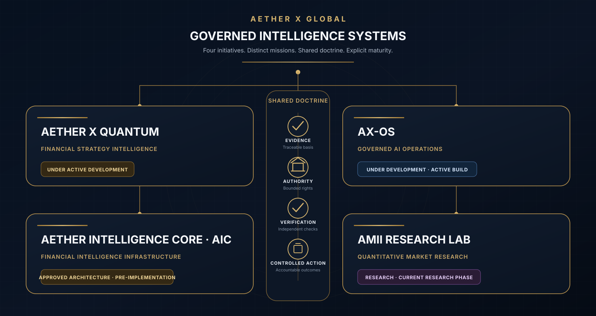
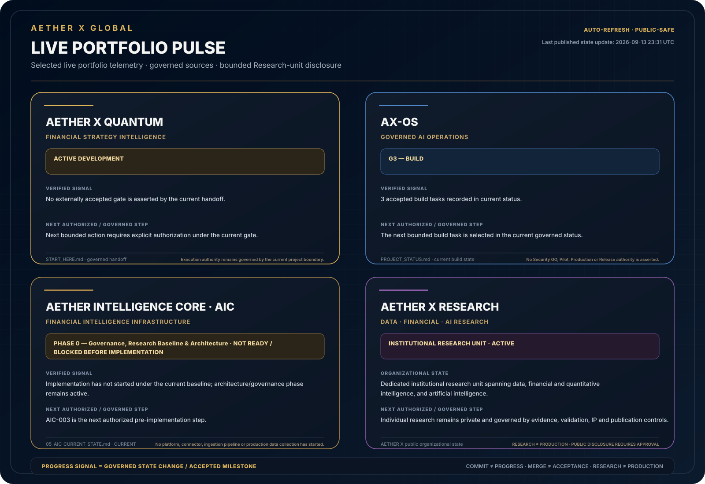
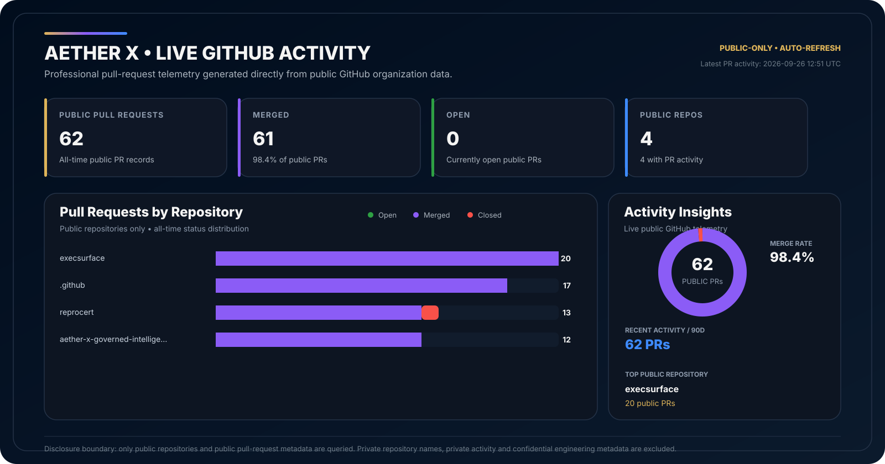

  

<h1 align="center">AETHER X GLOBAL</h1>

  <strong>A Governed Intelligence Systems Company</strong>

  <strong>Institutional Intelligence. Governed Autonomy.</strong>

  <strong>Build Intelligence That Can Be Trusted to Act.</strong>

  We engineer governed intelligence systems for consequential financial, research, knowledge, enterprise and institutional workflows.

  <a href="https://www.aetherxglobal.com"><strong>Official Website</strong></a>
  &nbsp;&nbsp;·&nbsp;&nbsp;
  <a href="#portfolio--research-at-a-glance">Portfolio & Research</a>
  &nbsp;&nbsp;·&nbsp;&nbsp;
  <a href="#investor-evidence">Investor Evidence</a>
  &nbsp;&nbsp;·&nbsp;&nbsp;
  <a href="#our-thesis">Our Thesis</a>
  &nbsp;&nbsp;·&nbsp;&nbsp;
  <a href="#engineering-doctrine">Engineering Doctrine</a>
  &nbsp;&nbsp;·&nbsp;&nbsp;
  <a href="#engineering-pulse">Engineering Pulse</a>

---

## Company

AETHER X GLOBAL builds the system layer around advanced intelligence: the evidence, authority, controls, verification and institutional memory required to make AI useful in consequential work.

Our engineering approach is designed around **multi-model intelligence, specialized agents, governed data and knowledge, bounded authority, controlled execution, independent verification and measurable outcomes**.

The objective is not unrestricted autonomy. The objective is **useful intelligence with explicit evidence, authority and accountability**.

---

## Portfolio & Research at a Glance

Our current operating portfolio includes **three governed intelligence system initiatives and one dedicated institutional research unit**. The visual architecture below shows **portfolio membership, maturity or organizational state, domain and role** — not technical integration between initiatives.

  

> **Portfolio boundary:** The visual represents portfolio membership and strategic roles only. Shared ownership, branding or engineering doctrine does not imply technical integration, shared runtime, deployment dependency or production interoperability. Product-to-product integration requires separate approval and implementation evidence.

### Portfolio Snapshot

| Initiative / Unit | Current maturity / state | Primary role |
|---|---|---|
| **AETHER X Quantum** | `UNDER ACTIVE DEVELOPMENT` | Advanced technical-analysis and strategy-engineering platform, designed to support evidence-governed market analysis, strategy construction, quantitative validation and controlled decision workflows. |
| **AX-OS** | `UNDER DEVELOPMENT · ACTIVE BUILD` | Internal-first governed AI operations, authority, execution, verification and institutional learning. |
| **AETHER Intelligence Core (AIC)** | `APPROVED ARCHITECTURE · PRE-IMPLEMENTATION` | Strategic company infrastructure initiative intended to become a durable, high-integrity global financial-information asset, designed to provide point-in-time accuracy, provenance and reusable intelligence foundations for AETHER X platforms and AI systems. |
| **AETHER X Research** | `INSTITUTIONAL RESEARCH UNIT · ACTIVE` | Dedicated institutional research unit conducting evidence-governed research across data, financial and quantitative intelligence, and artificial intelligence, supporting AETHER X through rigorous investigation, experimentation, validation and reproducible knowledge development. |

Each AETHER X initiative is presented according to its **current verified maturity, authority boundary and public-disclosure state**. AETHER X Quantum is under active development and is not represented as providing guaranteed investment outcomes. AETHER Intelligence Core (AIC) remains at the **approved-architecture / pre-implementation** stage; its strategic role is defined, while implementation remains governed and gated. AETHER X Research operates as the company’s institutional research unit, with research activities remaining subject to evidence, validation, intellectual-property and publication controls.

**Public access:** Core development and research repositories remain private. Public GitHub materials consist only of intentionally released corporate, engineering and evidence artifacts. Any future disclosure of implementation details, research results or technical material requires explicit review and approval.

Strategic direction is stated separately from implemented capability. **Research does not imply production readiness, architecture does not imply implementation, and development status does not imply commercial or operational readiness.**

---

## Investor Evidence

AETHER X is designed to be evaluated on **evidence rather than presentation**. For investors, strategic partners and institutional reviewers, this public GitHub surface provides a bounded diligence layer that separates what can be inspected directly from what requires controlled diligence or remains unestablished.

### Governed Portfolio-State Evidence

  

The Live Portfolio Pulse publishes selected initiative-state signals from allowlisted governed sources and a bounded public organizational state for the Research unit without exposing private repository content. It does not infer aggregate completion percentages and does not convert commits, merges, research or design into acceptance or production claims.

| Public diligence signal | Current public evidence |
|---|---|
| **Corporate thesis & engineering doctrine** | Publicly stated and directly inspectable in this profile. |
| **Portfolio maturity & research structure** | Explicitly disclosed by initiative or unit and bounded by current maturity / organizational state. |
| **Governed portfolio-state publication** | Live Portfolio Pulse: a public output generated from allowlisted governed initiative sources plus a bounded Research-unit disclosure state. |
| **Public engineering activity** | Engineering Pulse generated from public GitHub organization data. |
| **Commercial / financial traction** | Not established by this public GitHub profile. |
| **Production readiness / customer outcomes** | Not implied unless separately evidenced and explicitly disclosed. |

For the evidence definitions, limitations, diligence sequence and disclosure rules, see:

**[Public Investor Evidence →](./INVESTOR_EVIDENCE.md)**

> **Diligence boundary:** GitHub evidence is not a substitute for technical, commercial, financial, capitalization, legal, security or intellectual-property due diligence.

---

## Our Thesis

Artificial intelligence becomes institutionally valuable when capability is connected to **evidence, bounded authority, controlled execution, independent verification and accountable outcomes**.

AETHER X does not organize its core strategy around building the largest general-purpose foundation model. We engineer the governed intelligence layer that can enable models, specialized agents, institutional knowledge and deterministic controls to operate inside accountable systems.

> **The durable value of advanced AI systems is not raw model capability alone. It is the system that makes intelligence governable, evidence-backed, secure, measurable and safe to use in real decisions and controlled execution.**

---

## The AETHER X Intelligence Chain

  

Individual projects may implement only the parts of this chain appropriate to their domain and risk.

---

## What We Engineer

- **Intelligence orchestration** — model abstraction, routing, specialized agents, structured workflows and deterministic components.
- **Knowledge & evidence systems** — provenance, point-in-time knowledge, institutional memory, versioned decisions and reproducible research artifacts.
- **Governance & authority systems** — permissions, policies, approvals, delegated authority, least privilege and bounded execution.
- **Verification systems** — testable acceptance criteria, independent checks, evidence packages and verified outcomes.
- **Financial & quantitative intelligence** — data lineage, validation discipline, scenario analysis, reproducibility and risk-aware decision support.
- **Research & decision integrity** — governed research lifecycle, research registry, evidence, reproducibility, scientific-state boundaries and controlled promotion of research claims.
- **Operational intelligence** — observable, recoverable, measurable and auditable systems designed for real institutional workflows.

---

## Engineering Doctrine

<table>
<tr>
<td width="33%" valign="top">

### Evidence Before Confidence

Important claims should remain traceable to evidence, provenance, assumptions and time.

</td>
<td width="33%" valign="top">

### Authority Before Action

Capability does not imply permission. Consequential actions require an explicit authority path.

</td>
<td width="33%" valign="top">

### Verification Before Acceptance

Execution completion is not acceptance. Critical outcomes require evidence and verification.

</td>
</tr>
<tr>
<td width="33%" valign="top">

### Security by Design

Identity, least privilege, trust boundaries, recovery, audit and revocation are architectural concerns.

</td>
<td width="33%" valign="top">

### Multi-Model Resilience

Models are components. Domain logic and institutional memory should remain portable where technically and economically justified.

</td>
<td width="33%" valign="top">

### Measurable Outcomes

We care about verified outcomes, reliability, risk, rework and cost — not model activity for its own sake.

</td>
</tr>
</table>

---

## Operating Principles

`CAPABILITY ≠ AUTHORITY`  
`OUTPUT ≠ FACT`  
`RECOMMENDATION ≠ DECISION`  
`EXECUTION COMPLETE ≠ VERIFIED`  
`RESEARCH ≠ PRODUCTION`  
`DESIGN ≠ IMPLEMENTATION`

---

## Technology Landscape

  

---

## Engineering Pulse

  

The dashboard is generated from **public GitHub organization data only**. Private repositories, private activity and confidential engineering metadata are neither queried nor published by this public view.

---

## Public Engineering

AETHER X publishes selected technical references, specifications and tools only after appropriate security, intellectual-property and public-disclosure review.

### Public Technical References

- **[AX-PUB-ARCH-001 — Governed Intelligence Reference Architecture](../public-specs/AX-PUB-ARCH-001_GOVERNED_INTELLIGENCE_REFERENCE_ARCHITECTURE.md)** — `PUBLIC TECHNICAL REFERENCE · CONCEPTUAL / NON-PRODUCT-SPECIFIC`

This reference architecture describes the company-level governed-intelligence control pattern around **evidence, reasoning, decision, authority, controlled execution, verification and institutional learning**. It is technology-neutral and does not assert shared implementation or technical integration across AETHER X initiatives.

Public repositories and artifacts represent intentionally released engineering work. Proprietary platforms, confidential architecture, credentials, internal security controls, private customer information and unpublished intellectual property remain private.

---

## Security

Do not report security vulnerabilities through public issues. Responsible-disclosure instructions should be followed when formally published by the organization.

---

## Contact

Official institutional contact channels are available through the company website.

**Official website:** [aetherxglobal.com](https://www.aetherxglobal.com)

---

  <strong>Institutional Intelligence. Governed Autonomy.</strong>

  © 2026 AETHER X GLOBAL. All rights reserved.

