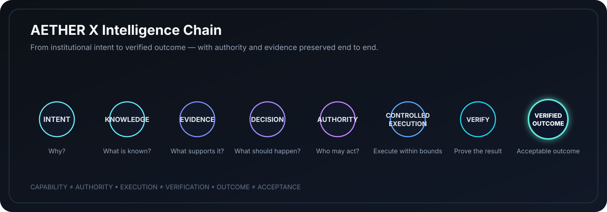
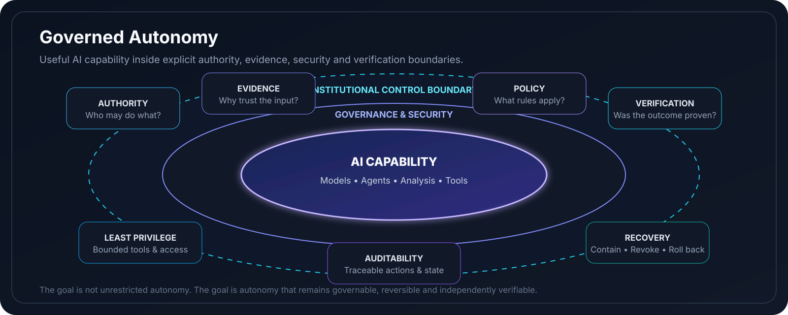
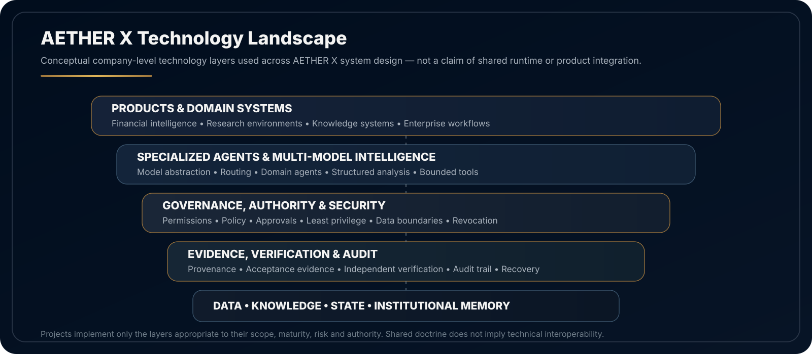

  

# AETHER X GLOBAL

  <strong>Build Intelligence That Can Be Trusted to Act.</strong>

  <strong>Institutional Intelligence. Governed Autonomy.</strong>

  Governed intelligence systems for consequential financial, knowledge, research, enterprise and institutional workflows.

  <a href="https://www.aetherxglobal.com"><strong>Official Website</strong></a>
  &nbsp;&nbsp;·&nbsp;&nbsp;
  <a href="#our-thesis">Our Thesis</a>
  &nbsp;&nbsp;·&nbsp;&nbsp;
  <a href="#what-we-build">What We Build</a>
  &nbsp;&nbsp;·&nbsp;&nbsp;
  <a href="#engineering-standard">Engineering Standard</a>
  &nbsp;&nbsp;·&nbsp;&nbsp;
  <a href="#public-engineering">Public Engineering</a>

---

## Our Thesis

Artificial intelligence becomes institutionally valuable when capability is connected to **evidence, bounded authority, controlled execution, independent verification and accountable outcomes**.

AETHER X does not organize its strategy around building the largest general-purpose model. We engineer the governed, multi-model intelligence layer that enables specialized models, agents, institutional knowledge and deterministic controls to operate as one accountable system.

> **The durable value of advanced AI systems is not raw model capability alone. It is the system that makes intelligence governable, evidence-backed, secure, measurable and safe to use in real decisions and controlled execution.**

---

## The AETHER X Intelligence Chain

  

This operating chain expresses the company-level design principle behind AETHER X systems: intelligence should remain traceable from intent through evidence, authority, execution and verified outcome.

---

## What We Build

<table>
<tr>
<td width="50%" valign="top">

### Governed Intelligence Infrastructure

Modular infrastructure for model orchestration, institutional knowledge, evidence records, permissions, policy enforcement, traceability, controlled execution and verification.

</td>
<td width="50%" valign="top">

### Specialized AI Agents

Domain-focused agents designed to work within explicit permissions, evidence requirements, bounded tools, human oversight and measurable acceptance conditions.

</td>
</tr>
<tr>
<td width="50%" valign="top">

### Knowledge & Evidence Systems

Systems for provenance, point-in-time knowledge, institutional memory, versioned decisions, reproducible research artifacts and evidence-backed outputs.

</td>
<td width="50%" valign="top">

### Financial & Quantitative Intelligence

Risk-aware analytical systems emphasizing point-in-time correctness, data lineage, deterministic research primitives, validation discipline and reproducible evidence.

</td>
</tr>
</table>

---

## The Intelligence Layer

AETHER X systems are designed around a shared engineering layer that can combine:

- Model routing and provider abstraction
- Specialized agents and bounded capabilities
- Institutional knowledge and evidence provenance
- Explicit authority, approvals and least privilege
- Controlled tools and execution boundaries
- Independent verification and acceptance evidence
- Auditability, observability and recovery
- Quality, cost and risk measurement

The objective is not unrestricted autonomy. The objective is **useful autonomy with explicit authority, evidence and verification**.

  

---

## Technology Landscape

  

---

## Flagship Product

### AETHER X Quantum

AETHER X Quantum is the current flagship application of the shared intelligence layer: a governed financial intelligence and strategy engineering environment for market and economic research, quantitative analysis, evidence-backed hypothesis testing, backtesting and validation, sensitivity and stress testing, and risk-aware decision support. Quantum is designed for disciplined analysis and research and does not promise or guarantee investment outcomes.

---

## Engineering Standard

<table>
<tr>
<td width="33%" valign="top">

### Governed by Design

Authority, permissions, approvals and accountability are explicit system properties rather than assumptions hidden inside model behavior.

</td>
<td width="33%" valign="top">

### Evidence Before Confidence

Important conclusions and actions are expected to retain provenance, assumptions, evidence and verification appropriate to their risk.

</td>
<td width="33%" valign="top">

### Secure by Default

Least privilege, explicit authority, secrets protection, containment, auditability, recovery and revocation are built into consequential workflows.

</td>
</tr>
<tr>
<td width="33%" valign="top">

### Multi-Model by Design

Models are replaceable components. Domain logic and institutional memory should remain portable unless a deliberate architectural reason requires otherwise.

</td>
<td width="33%" valign="top">

### Independently Verifiable

Execution completion is not acceptance. Material outcomes require evidence and verification independent of the executor where risk warrants it.

</td>
<td width="33%" valign="top">

### Measurable Value

Systems should be observable, recoverable and measurable across quality, cost, risk, reliability and verified outcome.

</td>
</tr>
</table>

---

## Operating Principles

`CAPABILITY ≠ AUTHORITY`  
`OUTPUT ≠ FACT`  
`RECOMMENDATION ≠ DECISION`  
`EXECUTION COMPLETE ≠ VERIFIED`  
`DONE ≠ ACCEPTED`

These distinctions are foundational to how AETHER X approaches AI-enabled work.

---

## Public Engineering

Selected reference implementations, specifications and tools are published publicly only after security, intellectual-property and release-readiness review.

Public repositories represent intentionally released engineering work. Proprietary platforms, confidential architecture, customer information, credentials, internal security controls and unpublished intellectual property remain private.

---

## Security

Do not report security vulnerabilities through public issues. Formal responsible-disclosure instructions will be published through the organization security policy. Until then, do not disclose vulnerability details publicly.

---

## Contact

Official institutional contact channels are available through the company website. No personal emails or unreleased support channels are published here.

**Official website:** [aetherxglobal.com](https://www.aetherxglobal.com)

---

  <strong>Engineering Intelligence. Building the Future.</strong>

  © 2026 AETHER X GLOBAL. All rights reserved.

