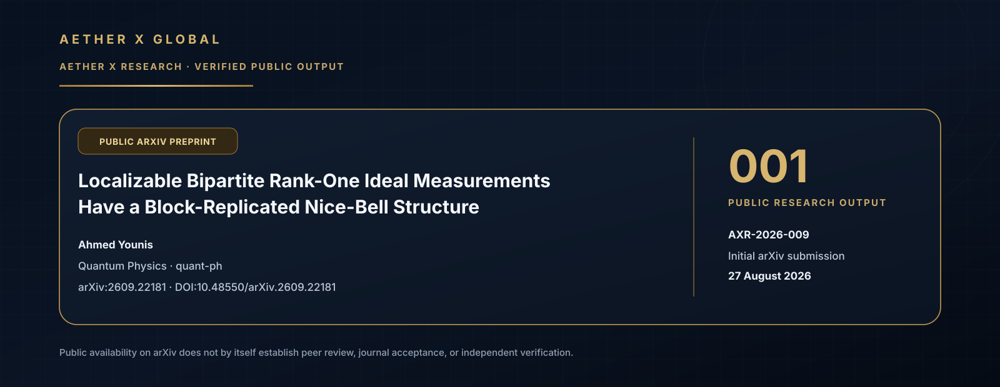

# AETHER X GLOBAL — Public Research Outputs

This page records selected public scientific outputs associated with the AETHER X Research program.

It is intentionally narrower than the private research repository. Only externally available research artifacts that can be independently located are listed here.

  

---

## Public Output Index

| # | Research record | Field | External record | Status |
|---|---|---|---|---|
| **001** | `AXR-2026-009` | Quantum Physics (`quant-ph`) | [arXiv:2609.22181](https://arxiv.org/abs/2609.22181) | `PUBLIC ARXIV PREPRINT` |

---

## AXR-2026-009 — Public Research Output 001

### Localizable Bipartite Rank-One Ideal Measurements Have a Block-Replicated Nice-Bell Structure

**Author:** Ahmed Younis  
**Public scholarly affiliation on paper:** Independent Researcher  
**AETHER X internal research record:** `AXR-2026-009`  
**Subject:** Quantum Physics (`quant-ph`)  
**arXiv:** [2609.22181](https://arxiv.org/abs/2609.22181)  
**DOI:** [10.48550/arXiv.2609.22181](https://doi.org/10.48550/arXiv.2609.22181)  
**Initial arXiv submission:** 27 August 2026  
**Public status:** `PUBLIC ARXIV PREPRINT`  
**Journal / peer-review status:** Not established

### Scientific contribution

The paper proves a complete structural characterization of finite-dimensional bipartite rank-one ideal projective measurements that are localizable without communication in the setting studied by Akibue and Miyazaki.

Up to local-unitary equivalence, the characterized measurement bases have a block-replicated nice-Bell structure.

The paper states that this establishes **Conjecture 1 of Akibue and Miyazaki** and gives a protocol-independent classification for this class of measurements.

### Public significance

This output is an externally reachable scientific artifact that can be independently located on arXiv. It gives the AETHER X Research program a concrete public research reference point tied to a specific internal research record while leaving unpublished research systems private.

It is evidence of **public scholarly output**. It is not, by itself, evidence of peer review, journal acceptance, independent verification, product readiness, or commercial adoption.

### Research provenance

AETHER X Research records this work internally as `AXR-2026-009`.

The public arXiv manuscript itself lists the author's affiliation as **Independent Researcher**. AETHER X therefore describes the paper publicly as an **AETHER X-associated research output** rather than altering the scholarly affiliation shown on the paper.

### Evidence and maturity boundary

`PUBLIC PREPRINT ≠ PEER REVIEW`

`ARXIV AVAILABILITY ≠ JOURNAL ACCEPTANCE`

`PUBLICATION ≠ INDEPENDENT VERIFICATION`

The public arXiv record is the authoritative external source for the paper title, author, subject classification, abstract, version history and DOI.

**[Read the authoritative public record on arXiv →](https://arxiv.org/abs/2609.22181)**

---

## Public Research Standard

AETHER X distinguishes explicitly between:

- a research hypothesis;
- internal computational or proof evidence;
- a public preprint;
- independent technical review;
- peer-reviewed journal publication;
- production or commercial claims.

Only externally verifiable public artifacts should be represented here as public research outputs.

As additional research becomes publicly verifiable, it should be added to the **Public Output Index** using the same evidence and maturity standard.
